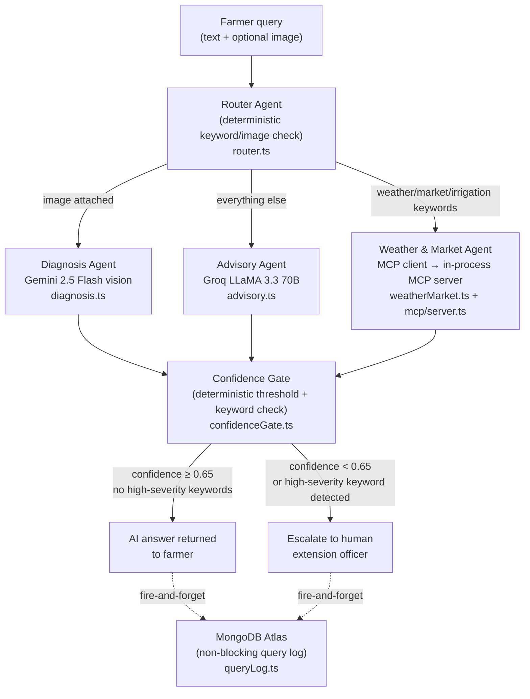

# F.A.R.M.E.R.

**Futuristic Agriculture & Resource Management Ecosystem Router** — a multi-agent AI system that routes smallholder farmers' queries (text and crop images) to the appropriate specialist agent and escalates uncertain or high-severity cases to a human extension officer.

---

## Track & Context

Built for the **Kaggle × Google AI Agents Intensive Vibe Coding Capstone**, Agents for Good track.

Smallholder farmers in rural Khyber Pakhtunkhwa have limited access to agricultural extension officers, creating a coordination gap that delays crop disease response and reduces yields. This system mirrors a routing problem already documented in the author's own NSRI-published research on AI routing for Lady Health Workers in the same region — the same structural failure (too few specialists, too many dispersed users) applied to agricultural extension.

---

## Architecture



**Router logic** (priority order, first match wins):
1. Image attached → `diagnosis`
2. Weather / market / irrigation keywords in text → `weather_market`
3. Everything else → `advisory`

The router, irrigation interpreter, and confidence gate are all deterministic (no LLM calls) so routing decisions are inspectable, unit-testable, and stable across model versions.

---

## Capstone Concept Mapping

| Capstone concept | Where demonstrated in this repo | Notes |
|---|---|---|
| **Agent / multi-agent system** | `backend/src/lib/agents/router.ts`, `diagnosis.ts`, `advisory.ts`, `weatherMarket.ts` | Four distinct agents with separate responsibilities, orchestrated by a deterministic router |
| **MCP Server** | `backend/src/lib/mcp/server.ts`, `weatherMarket.ts` | A real `McpServer` (MCP SDK) exposes three tools; the weather agent is a real MCP client connected via `InMemoryTransport` |
| **Security features** | `backend/src/lib/security/confidenceGate.ts`, `timeout.ts`, `middleware/security.ts`, `middleware/validate.ts`, `services/queryLog.ts` | CIA-triad controls across all layers (see Security section below) |
| **Deployability** | `backend/package.json`, `frontend/package.json`, `backend/.env.example`, `frontend/.env.example` | Standard Node.js + Vite stack; all config is env-var driven with `.env.example` templates; no compiled binary dependencies |
| **Antigravity** | _Not a code-level concept in this repo_ | Demonstrated through the development process and the agent-assisted coding workflow shown in the submission video; there is no source file to link here |
| **Agent skills** | _Not a code-level concept in this repo_ | Demonstrated in the submission video as the agent's applied domain knowledge (agricultural extension for KP); the skill manifests in the system prompts in `diagnosis.ts` and `advisory.ts`, but "Agent skills" as a capstone concept refers to the demonstrated capability, not a library import |

---

## Data Sources

| Source | What it provides | API key required |
|---|---|---|
| **Gemini 2.5 Flash** (`gemini-2.5-flash`) | Crop image diagnosis | Yes — `GEMINI_API_KEY` |
| **Groq LLaMA 3.3 70B** (`llama-3.3-70b-versatile`) | Plain-language advisory text | Yes — `GROQ_API_KEY` |
| **Open-Meteo** | 3-day weather forecast (temperature, precipitation, weather code) | No |
| **Open-Meteo** | Hourly soil moisture, evapotranspiration, vapor-pressure deficit for the irrigation signal | No |
| **Static KP mandi table** | Reference prices for 8 common crops (wheat, maize, rice, tomato, onion, potato, sugarcane, cotton) in PKR/maund | No (static in-process data) |
| **MongoDB Atlas** | Non-blocking query-metadata logging only | Optional — `MONGODB_URI` |

**On the market price tool:** `get_kp_market_price` returns figures from a hardcoded reference table, not a live mandi feed. This is labeled `"dataType": "static_placeholder"` in every response. No free real-time mandi price API exists for KP/Pakistan that was verifiable at the time of building this — this was confirmed by research, not assumed. The tool response includes an explicit disclaimer telling the farmer to check their local mandi before selling.

---

## Security

No standalone `security_audit_report.md` was committed to this repository. The audit findings are captured inline as `// SECURITY AUDIT:` comments throughout the source code. The verified controls, organized by the CIA triad, are:

### Confidentiality
- **No secrets in frontend bundle**: All AI provider keys (`GEMINI_API_KEY`, `GROQ_API_KEY`) and the MongoDB URI are backend-only environment variables; they never reach the Vite build.
- **Restricted logs endpoint**: `GET /api/logs` requires a `LOGS_API_KEY` header; if the key is unset, the endpoint returns 403 fail-closed (`backend/src/config/env.ts`).
- **Minimal logging schema**: `QueryLog.ts` stores only scalar metadata (intent, confidence, escalation flag, 100-char answer preview). Full answers, reasoning traces, and binary images are explicitly excluded.
- **Key sanitization in error paths**: Error messages are pattern-scrubbed (`key[=:]\s*\S+` → `key=[redacted]`) before logging or returning to the client.
- **Frontend reasoning obfuscation**: The agent routing trace is collapsed by default in `TraceList.tsx`.

### Integrity
- **Zod schema validation on all inputs**: Query text (max 4 000 chars) and file uploads (JPEG/PNG only, max 8 MB) are validated server-side in `middleware/validate.ts`; client-side restrictions alone are not trusted.
- **Zod schema validation on Gemini output**: `diagnosis.ts` validates the raw model JSON response against a typed schema before any field is used downstream.
- **No `dangerouslySetInnerHTML`**: All AI answers are rendered as React text nodes.
- **Helmet middleware**: `X-Powered-By` removed, HSTS set, MIME sniffing disabled, framing denied (`middleware/security.ts`).

### Availability
- **Rate limiting**: 30 requests per 15-minute window on `POST /api/query` via `express-rate-limit` (`middleware/security.ts`).
- **Timeout-wrapped external calls**: All outbound calls use `withTimeout` (`backend/src/lib/security/timeout.ts`) — Gemini (30 s), Groq (12 s), MCP tool calls (8 s each), MCP connect (5 s).
- **Non-blocking MongoDB**: Mongo failure never blocks the agent response path; the service is fire-and-forget (`services/queryLog.ts`).
- **Confidence-gated escalation**: Responses with diagnosis confidence below 0.65 or containing high-severity keywords (`"spreading fast"`, `"whole field"`, `"outbreak"`, `"dying"`, etc.) are escalated to a human extension officer rather than returned as AI answers (`confidenceGate.ts`).

---

## Local Setup

### Backend

```bash
cd backend
cp .env.example .env
# Open .env and fill in at minimum:
#   GEMINI_API_KEY=<your key>
#   GROQ_API_KEY=<your key>
# Optional:
#   MONGODB_URI=<your Atlas URI>   # leave blank to disable logging
npm install
npm run dev
# → http://localhost:3001
```

**API endpoints:**

| Method | Path | Purpose |
|---|---|---|
| `GET` | `/api/health` | Liveness check; reports whether MongoDB logging is active |
| `POST` | `/api/query` | Multipart `text` (string) + optional `image` (JPEG/PNG ≤ 8 MB) → agent orchestration |
| `GET` | `/api/logs` | Last 50 query logs; requires `Authorization: Bearer <LOGS_API_KEY>` header |

### Frontend

```bash
cd frontend
npm install
# Create frontend/.env.local (gitignored):
echo "VITE_API_BASE_URL=http://localhost:3001" > .env.local
npm run dev
# → http://localhost:5173
```

---

## Known Limitations

These are real constraints documented in the code, not softened for presentation:

- **Market prices are static.** `get_kp_market_price` returns a hardcoded reference table (PKR/maund for 8 crops). It must not be presented to farmers as a live mandi quote. A live replacement would require a provincial agriculture department or AMIS Pakistan feed, which was not available at time of building.
- **Soil moisture and ET are model estimates, not sensor readings.** Open-Meteo's `soil_moisture_0_to_1cm` and `evapotranspiration` fields are regional atmospheric-model outputs. They are accurate at regional scale but not calibrated to a specific field's soil composition or irrigation history.
- **Weather/market routing is keyword matching.** The router checks the farmer's text against a fixed keyword list (`WEATHER_MARKET_KEYWORDS` in `router.ts`). There is no structured intent extraction — an ambiguous query that uses none of the listed keywords goes to the advisory agent regardless of what the farmer actually meant.
- **Diagnosis is visual AI, not a laboratory result.** Gemini's visual assessment is explicitly labeled as such in the formatted answer, and low-confidence diagnoses are escalated rather than served.
- **Default coordinates fall back to Peshawar.** If a farmer does not include a `lat,lon` pair in their query, weather and irrigation data defaults to Peshawar (34.0151°N, 71.5249°E). The fallback is documented in `.env.example` and can be overridden via environment variable.

---

## Roadmap

The current system focuses on getting the core routing architecture right — deterministic triage, confidence-gated escalation, and real data where it's honestly available. The following are natural next layers on top of that foundation, not yet built:

- **Multilingual support (Urdu, Pashto).** The target user is a farmer in rural Khyber Pakhtunkhwa; English-only interaction is a real adoption barrier. Both Gemini and Groq support multilingual prompting, so this is an extension of the existing advisory and diagnosis agents rather than a new system.
- **Voice input.** Many smallholder farmers are more comfortable speaking than typing, particularly for describing a problem in detail. A voice-to-text layer ahead of the existing router would let a farmer ask a question the same way they'd ask a person, similar in spirit to conversational assistants like ChatGPT's voice mode.
- **Land suitability analysis.** Using the same Open-Meteo data already powering the irrigation signal (soil moisture, temperature) cross-referenced against known crop requirements, the system could suggest which crops are viable for a given plot before a farmer plants, rather than only reacting after a problem appears.

Larger ideas — farmer cooperative/group features, a direct farmer-to-buyer marketplace, and multi-month price forecasting — were considered and deliberately excluded from this roadmap. Each is a distinct product with its own scope (trust and payment systems, historical time-series data that does not currently exist in an accessible form for KP mandi prices, logistics coordination) rather than a natural extension of this routing architecture, and are noted here only as acknowledged possible future directions, not committed next steps.

---

## License

This repository is **not MIT licensed**. It is published under a restrictive all-rights-reserved license — public visibility is for portfolio and hackathon evaluation purposes only. Reproduction, use, or distribution requires explicit written permission from the author. See [`LICENSE`](LICENSE) for full terms.

---

*F.A.R.M.E.R. — Kaggle × Google AI Agents Intensive Vibe Coding Capstone 2026 | Muhammad Nameer Shah*
